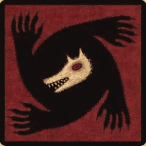
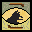
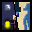

<div align="center">
<br>
<br>
  

<br>

# MineWolves

An adaptation of the social deduction game [The Werewolves of Millers Hollow](https://en.wikipedia.org/wiki/The_Werewolves_of_Millers_Hollow) in Minecraft using Minestom
</div>
<br>

## Current roles

|                                                                 Role                                                                 | Description                                                                                                                                                                                                                               |
|:------------------------------------------------------------------------------------------------------------------------------------:|:------------------------------------------------------------------------------------------------------------------------------------------------------------------------------------------------------------------------------------------|
|   <br/>**Villager**    | The most common role, with no special abilities. They must rely on their intuition and the information shared by others to identify the werewolves.                                                                                       |
|     <br/>**Werewolf**      | The main antagonists of the game. They can secretly communicate with each other and choose a victim to eliminate each night. Their goal is to outnumber the villagers.                                                                    |
|       <br/>**Seer**        | A powerful role that can investigate one player each night to determine if they are a werewolf or not. The seer must use this information wisely to guide the villagers.                                                                  |
|     ️  <br/>**Witch**     | A cunning role with two powerful potions. Each night, the witch can choose to save a player from being killed by the werewolves or poison a player to eliminate them. The witch must decide when to use their potions for maximum impact. |
|     <br/>**Hunter**      | A brave role that can take down one player with them if they are killed by the werewolves. The hunter must choose their target carefully, as they can only use this ability once.                                                         |
| <br/>**Little Girl** | A sneaky role that can peek at the werewolves during the night without being detected. The little girl must be cautious, as being caught by the werewolves can lead to her demise.                                                        |

## Supported languages
- English ([@Paul](https://github.com/Paylicier))
- French ([@Paul](https://github.com/Paylicier))

## Setup

### Prerequisites
- Java **25** or higher
- A Minecraft client (1.21.11)

### Running the server
1. Clone the repository:
   ```bash
   git clone https://github.com/Paylicier/MineWolves
   cd MineWolves
    ```
2. Build the project using Gradle:
   ```bash
   ./gradlew shadowJar
   ```
3. Run the server:
   ```bash
   java -jar build/libs/MineWolves-1.0-SNAPSHOT-all.jar
   ```
4. Connect to the server using your Minecraft client at `localhost:25565`.

## Roadmap/Todo
- [ ] Add more roles (e.g. Cupid, Thief, etc.)
- [ ] Implement voice-chat using Mumble/Simple Voice Chat (tbd)
- [ ] Make a wiki with detailed role descriptions and screenshots
- [ ] Setup Crowdin or smth for translations

## Acknowledgements
- Role icons by [@MathiasDPX](https://github.com/MathiasDPX)
- Game highly inspired by [The Werewolves of Millers Hollow](https://en.wikipedia.org/wiki/The_Werewolves_of_Millers_Hollow)
- Built using [Minestom](https://minestom.net/)

## License
This project is available under **GNU Affero General Public License v3**

Please read the license carefully before using this software. If you have any questions about licensing, please open an issue.

---

<div align="center">
  Built with 🐺 and 🚈 by Paul
</div>
